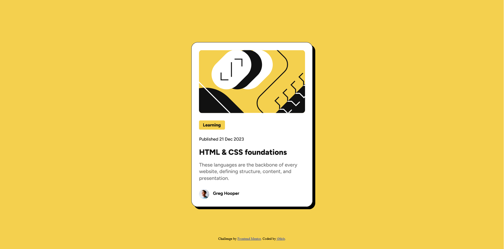

# Frontend Mentor - Blog preview card solution

This is a solution to the [Blog preview card challenge on Frontend Mentor](https://www.frontendmentor.io/challenges/blog-preview-card-ckPaj01IcS). Frontend Mentor challenges help you improve your coding skills by building realistic projects.

## Table of contents

- [Overview](#overview)
  - [The challenge](#the-challenge)
  - [Screenshot](#screenshot)
  - [Links](#links)
- [My process](#my-process)
  - [Built with](#built-with)
  - [What I learned](#what-i-learned)
  - [Continued development](#continued-development)
  - [Useful resources](#useful-resources)
- [Author](#author)
- [Acknowledgments](#acknowledgments)

## Overview

### The challenge

Users should be able to:

- See hover and focus states for all interactive elements on the page

### Screenshot

### Links

- Solution URL: [https://github.com/j0th4r/blog-preview-card](https://github.com/j0th4r/blog-preview-card)
- Live Site URL: [https://blog-preview-card-nine-ivory.vercel.app/](https://blog-preview-card-nine-ivory.vercel.app/)

## My process

### Built with

- Semantic HTML5 markup
- CSS custom properties
- Flexbox
- Mobile-first workflow

### Useful resources

- [nekoCalc](https://nekocalc.com/px-to-rem-converter) - This helped me for converting my pixel values to rem values.

## Author

- Frontend Mentor - [@j0th4r](https://www.frontendmentor.io/profile/j0th4r)
